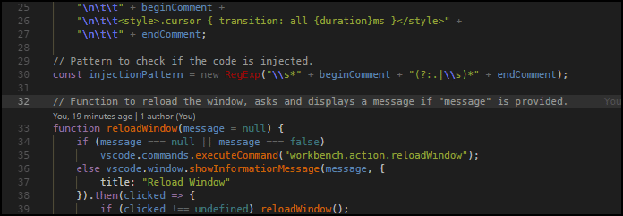

# SmoothType for Visual Studio Code

> ## DEPRECATION NOTICE
> For all intents and purposes, this project is deprecated and archived. There will be no further development, and support is not guaranteed.
>
> Please use the new `editor.cursorSmoothCaretAnimation` option in your user settings; the primary and only feature of this extension has been cored. The only thing that VSC cannot do is change the animation duration, this extension can.

---

**This extension adds a smooth typing animation,
similar to MS Office and the Windows 10 Mail app.**


**Note:** Please scroll down and read the section labeled [Important](#important).

---


## Preview



## Commands

 * `SmoothType: Enable Animation`
 * `SmoothType: Disable Animation`
 * `SmoothType: Reload Animation`

## Uninstalling

When you uninstall the extension, you must run the `SmoothType: Disable Animation` command from the command palette (<kbd>Ctrl</kbd>+<kbd>Shift</kbd>+<kbd>P</kbd>) to revert changes in VS Code first.

Additionally, if you're using the extension for fixing VS Code's title bar as mentioned in the [Important](#important) section, you must also run `Fix Checksums: Restore` after `SmoothType: Disable Animation` and before uninstalling either extension.

## Configuration

```js
{
  // Duration in milliseconds for the cursor to travel from one character position (or line) to the next.
  "smoothtype.duration": 80,
  // Ask before restarting after a command is successfully run.
  "smoothtype.autoReload": false
}
```

After changing `smoothtype.duration`, you must run `SmoothType: Enable Animation`.

## Important

Because Visual Studio Code does not have an API for modifying the editor CSS, this extension modifies the core index file that is loaded by the Electron browser. After enabling Smooth Typing, the editor may complain that it is corrupt, and ask you to reinstall. This is perfectly normal, and perfectly safe. Just click the cog on the top of the notification and elect to not be shown this message again.


In the future I may implement the same functionality as that extension into SmoothType itself.

The last command may have a different filename, but there will be only one VSIX package in the directory.

After running those commands, run `Reload Window` and `Fix Checksums: Apply` in VS Code.

**After every update, the extension must either be reloaded or enabled again.**

You also have to restart Visual Studio Code after every reload or change.

## Developer
<p align="center">
  
</p>
  
<p align="center">
  <a href="http://prasadbobby.me">P r a s d &nbsp; B o b by</a><br>
  <br>
    <b>Technology Keen | Web & Desktop Application Developer | Music Addict</b>
  <br><br>
  <br>
  <a href="https://github.com/prasadbobby">Github </a>  |
  <a href="https://www.linkedin.com/in/prasad-bobby-705002161/">LinkedIn</a>  |
  <a href="https://www.instagram.com/___mr_introvert____/">Instagram</a>
  <br><br>
  
  <br>
   <b>knvdurgaprasad610@gmail.com</b>
  <br>
  
</p>
